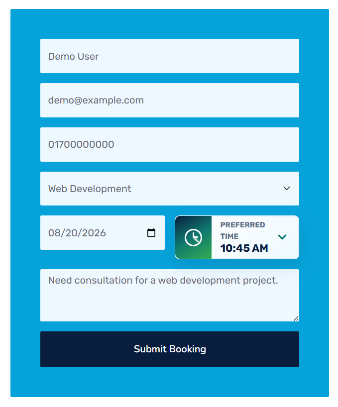
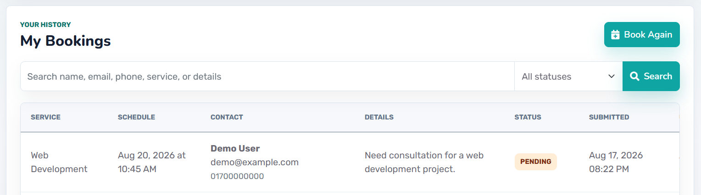
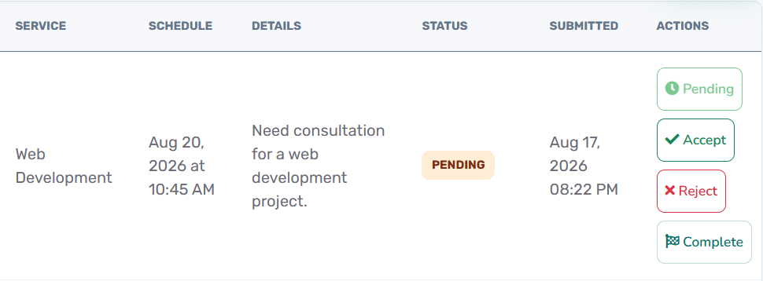

# Startup — IT Service Booking and Management System

Startup is a web-based IT service booking and management system developed with Laravel. It combines a public service website with user authentication, structured service booking, booking status tracking, contact messaging, and an administrative management panel.

This is an individual academic project developed after completing Laravel industrial training at Appstick and documented for CSE 4100 Field Work.

## Project Overview

The system is designed for a single IT service company where visitors can explore available services and registered users can submit structured booking requests.

Administrators can manage services, review bookings, update booking statuses, view users, and manage customer contact messages from a centralized dashboard.

The project demonstrates practical implementation of Laravel MVC architecture, authentication, middleware, relational database design, validation, role-based access control, responsive interfaces, and automated testing.

## Project Screenshots

### Home Page

<p align="center">
  
</p>

### Service Booking Form

<p align="center">
  
</p>

### User Booking History

<p align="center">
  
</p>

### Admin Booking Management

<p align="center">
  
</p>

## Main Features

### Public Website

* Responsive Home, About, Services, Features, Team, Testimonial, Booking, and Contact pages
* Active IT service catalogue
* Individual service detail pages
* Public contact/enquiry form
* Responsive layout for desktop and mobile devices

### User Authentication

* User registration
* Login and logout
* Session-based authentication
* Password hashing
* Protected authenticated routes

### Service Booking

* Authenticated service booking
* Service selection
* Preferred booking date and time
* 15-minute booking time slots
* Future-slot validation
* Booking availability checking
* Duplicate slot prevention
* Structured customer requirements/message field

### User Dashboard

* Personal user dashboard
* View booking history
* Search and filter bookings
* Track booking status
* User-specific booking record isolation

### Booking Status Workflow

Bookings can move through the following states:

* Pending
* Accepted
* Rejected
* Completed

Rejected and completed bookings release their reserved scheduling slot.

### Administration Panel

Administrators can:

* View dashboard statistics
* View and search registered users
* View and filter service bookings
* Update booking statuses
* Create new services
* Edit existing services
* Activate or deactivate services
* Delete services
* View and search contact messages

## Security and Validation

The project includes:

* Laravel authentication middleware
* Administrator authorization middleware
* CSRF protection
* Server-side form validation
* Password hashing
* User-specific booking access
* Booking status validation
* Service availability validation
* Unique booking-slot protection
* Session-based access control

## Tech Stack

### Backend

* PHP 8.2+
* Laravel 12
* Laravel MVC
* Eloquent ORM
* Laravel Middleware
* Laravel Migrations

### Frontend

* Blade Templates
* HTML5
* Bootstrap 5
* CSS
* JavaScript

### Database

* MySQL
* Relational database design
* Foreign keys
* Database indexes
* Laravel migrations

### Testing and Development

* Pest
* Git
* Composer
* Vite

## Core Data Models

The application uses four primary business models:

* `User`
* `Service`
* `Booking`
* `ContactMessage`

A registered user can own multiple bookings, while services and customer contact messages are managed independently.

## Application Workflow

1. A visitor browses available IT services.
2. The visitor creates an account or logs in.
3. The authenticated user selects a service and available booking slot.
4. The booking is submitted with a Pending status.
5. An administrator reviews the request.
6. The administrator updates the booking to Accepted, Rejected, or Completed.
7. The user can view the latest booking status from the personal dashboard.

## Installation

### Requirements

Make sure the following are installed:

* PHP 8.2 or later
* Composer
* MySQL
* Git

### Clone the Repository

```bash
git clone https://github.com/waziur/startup-service-booking-system.git
cd startup-service-booking-system
```

### Install PHP Dependencies

```bash
composer install
```

### Create Environment File

Copy `.env.example` and rename the copy to `.env`.

Then generate the Laravel application key:

```bash
php artisan key:generate
```

### Configure Database

Update the following values in `.env` according to your local MySQL configuration:

```env
DB_CONNECTION=mysql
DB_HOST=127.0.0.1
DB_PORT=3306
DB_DATABASE=startup
DB_USERNAME=root
DB_PASSWORD=
```

Create a MySQL database named:

```text
startup
```

### Run Database Migrations

```bash
php artisan migrate --seed
```

### Start the Application

```bash
php artisan serve
```

Then open:

```text
http://127.0.0.1:8000
```

## Testing

The project contains Pest-based tests for important application behaviours.

Run the test suite using:

```bash
php artisan test
```

## Project Context

**Project:** Startup — A Web-Based IT Service Booking and Management System
**Project Type:** Individual Academic Project
**Course:** CSE 4100 — Field Work / Industrial Training
**Department:** Computer Science and Engineering
**University:** Northern University of Business and Technology Khulna

## Developer

**Khan Waziur Rahman**

GitHub: [github.com/waziur](https://github.com/waziur)

## Future Improvements

Possible future extensions include:

* Email verification and password recovery
* Booking notifications
* Secure user–administrator messaging
* Online payment and invoicing
* File attachments
* Reporting and data export
* Audit logging
* Production deployment hardening
* Multilingual support

---

This repository represents the final development version of the Startup service booking and management system.
